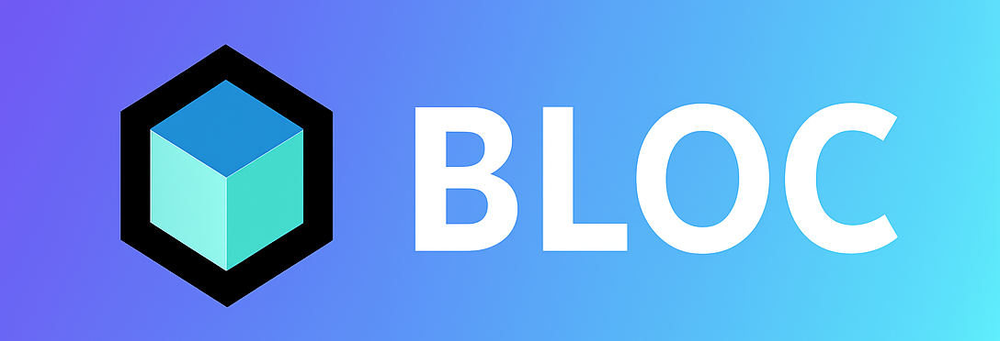

# Hi, I'm Rony Dawoud 👋
Flutter Developer
I build cross-platform iOS & Android apps using Flutter, BLoC, and Clean Architecture — with a focus on performance, scalability, and clean code.

---

## 🚀 Shipped Apps
| App | Platform | Description |
|-----|----------|-------------|
| [OrangePal](https://play.google.com/store/apps/details?id=com.raizer.michelfitness) | Google Play | Fitness app with personalized meal plans and workout routines |
| [Al Hakawatieh](https://apps.apple.com/us/app/alhakawatieh/id6739770522) | App Store & Google Play | Children's storytelling app with dual child/parent modes |
| Script | Internal | Conference management system with real-time check-in and seat planning |

---

## 🧱 How I Build
- Clean Architecture (data / domain / presentation)
- BLoC for predictable state management
- Repository pattern + use cases
- GetIt for dependency injection
- Tested on 20+ device models before release

---

## 🐍 Also Exploring
When not building apps, I let Python do the fun stuff — computer vision, automation, and whatever looks interesting.

---

## 🛠️ What I Work With

---

## 🌐 Connect

